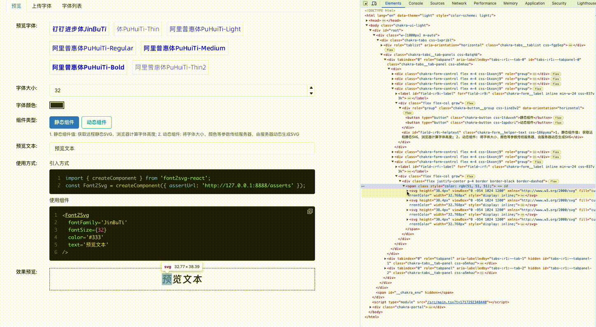
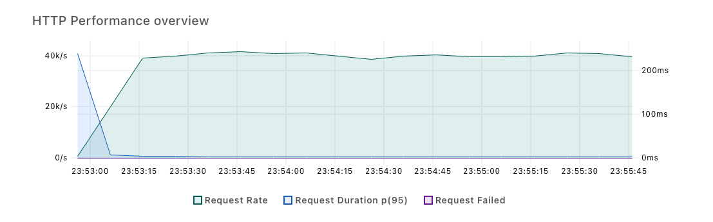

# font2svg

Convert Font To Svg.

Inspire by <https://www.bilibili.com/read/cv26464950/>

# Screen Recording

# Benchmark

load testing by [k6](https://k6.io/).

benckmark script is in `./benchmark/rondam-svg-access.js`.

**Dynamic Font Svg Generate API QPS: 40K**

[benchmakr result](./benchmark/html-report.html)

## Ref

- https://juejin.cn/post/6971673576017494053
